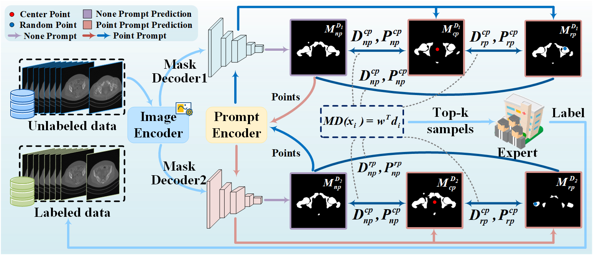

<div align="center">

# MD-SAM-AL

Cold-Start Active Learning for SAM via Mask Discrepancies

</div>

> MD-SAM-AL: This repository implements a mask-difference based cold-start active learning training framework. The code example is built on the ISIC-2017 skin lesion dataset. Download: [ISIC Challenge 2017 dataset](https://challenge.isic-archive.com/data/#2017).


MD-SAM-AL evaluates sample uncertainty through mask discrepancies under different prompts, selects top-k uncertain samples for expert annotation, updates $D_u$ and $D_l$, and trains the model iteratively.

## Highlights
- Top-K active learning per epoch: score by mask-difference (three prompts) and select `batch_size` images for annotation.
- Dual-decoder supervision: loss = average of two decoders (CE + Dice).
- GPU-batched AL scoring with AMP for efficiency (significantly faster than per-sample CPU loops).
- Validation every epoch, save `best_model_dice{score}.pth` when Dice improves.

## Directory Overview
- `trainer.py` — training entry with active learning and dual-decoder optimization.
- `sam_lora_image_encoder_prompt.py` — `LoRA_Sam` wrapper to adapt SAM2 image encoder (train LoRA only).
- `active_learning_strategies.py` — active learning strategies (mask-difference, factory) with GPU-batched, vectorized scoring.
- `datasets_skin.py` — datasets and transforms for training/validation (semi-supervised variant for labeled/unlabeled states).
- `val.py` — validation metrics; returns per-class `(dice, hd95)`. Training uses foreground Dice mean.
- `utils.py` — utilities and losses (e.g., `DiceLoss_Mask`).
- `sam2/` — SAM2 model construction and internals (upstream components).

## Environment
- Python ≥ 3.8, PyTorch ≥ 2.0, CUDA-capable GPU
- Required packages: torchvision, tensorboardX, medpy, scipy, einops, tqdm

Example installation:
```bash
pip install torch torchvision --index-url https://download.pytorch.org/whl/cu121
pip install tensorboardX medpy scipy einops tqdm
```

## Data Preparation
Expected structure under `--data_root`:
```
data_root/
  Training_Data/
  Training_GroundTruth/
  Validation_Data/
  Validation_GroundTruth/
```
Masks follow the naming: `image_name_segmentation.png`.

### SAM2 Weights
Trainer expects the following paths (already set in `trainer.py`):
```
model_cfg = ./sam2/configs/sam2.1/sam2.1_hiera_l.yaml
checkpoint = ./sam2/checkpoints/sam2.1_hiera_large.pt
```
Prepare them as follows:
```bash
mkdir -p sam2/checkpoints
# Place the SAM2 checkpoint here (rename to sam2.1_hiera_large.pt)
# Ensure the config file exists at sam2/configs/sam2.1/sam2.1_hiera_l.yaml
```

Download SAM2 (official):
- Repo: https://github.com/facebookresearch/segment-anything-2
- Model checkpoints: https://github.com/facebookresearch/segment-anything-2?tab=readme-ov-file#model-checkpoints

## Quick Start
Train with active learning + dual-decoder supervision:
```bash
python trainer.py \
  --data_root /path/to/skin_lesion_dataset \
  --output /path/to/output \
  --gpu 0 \
  --batch_size 4 \
  --pool_size 10 \
  --img_size 512 \
  --num_classes 1 \
  --max_epochs 50
```

TensorBoard logs are written to `output/Skin_{img_size}/log/`.

## Method Overview (brief)
Each epoch:
1) Active learning selects `batch_size` indices from a random unlabeled pool of size `pool_size` via the mask-difference score across three prompts (no-prompt, center, random).
2) Only the selected images load ground-truth labels for supervised training.
3) The model forwards two SAM2 decoders; total loss is the average of CE+Dice from both decoders.
4) Validate and compute the mean Dice across foreground classes; from epoch ≥ 10, save the best checkpoint.

## Key Arguments
- `--data_root`: dataset root (contains Training_/Validation_ folders as above)
- `--output`: output dir (creates `Skin_{img_size}` subdir)
- `--gpu`: GPU ids (e.g., `0`)
- `--base_lr`: learning rate (AdamW)
- `--batch_size`: batch size and AL selection size per epoch
- `--pool_size`: AL candidate pool size each epoch (trade-off speed vs. quality)
- `--img_size`: resize to training/validation resolution
- `--num_classes`: number of foreground classes (loss uses `num_classes + 1` including background)
- `--max_epochs`: total epochs
- `--promptmode`: prompt mode for SAM2 forward
- `--module`: LoRA module name (default `sam_lora_image_encoder_prompt`)
- `--rank`: LoRA rank
- `--lora_ckpt`: optional LoRA checkpoint loading (LoRA-only format)

## Checkpoints
- Best checkpoint is saved from epoch ≥ 10 as: `best_model_dice{score}.pth` (full `state_dict()` of `LoRA_Sam`).
- To reuse the fine-tuned weights:
```python
import torch
from importlib import import_module
from sam2.build_sam import build_sam2

model_cfg = "./sam2/configs/sam2.1/sam2.1_hiera_l.yaml"
ckpt = "./sam2/checkpoints/sam2.1_hiera_large.pt"
sam = build_sam2(model_cfg, ckpt)
pkg = import_module("sam_lora_image_encoder_prompt")
net = pkg.LoRA_Sam(sam, r=4).cuda()
net.load_state_dict(torch.load("/path/to/best_model_dice0.8732.pth"))
net.eval()
```
